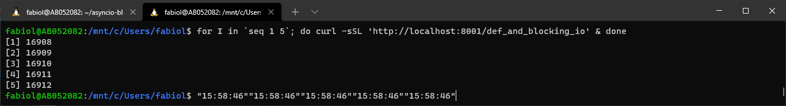

# Asyncio and Blocking Code

[](https://opensource.org/licenses/Apache-2.0)

Didatic implementation that shows issues when dealing with (IO) blocking code in async Python.

## Run using Docker

Build a docker image that launches the API server:

```bash
docker build -t asyncio-blocking-io .
```

Then, start the API server:

```bash
docker run -it -p 8000:8000 \
  --rm \
  --name asyncio-blocking-io \
  asyncio-blocking-io
```

Arguments:

```bash
usage: uvicorn asyncio_blocking_io.app:app [-h] [--host TEXT] [--port INTEGER] [--workers INTEGER]
Asyncio and Blocking Code
optional arguments:
  -h, --help         show this help message and exit.
  --host TEXT        Bind socket to this host (default: 127.0.0.1).
  --port INTEGER     Port for HTTP server (default: 8000).
  --workers INTEGER  Number of worker processes.
```

## Tests

Each test sends 5 concurrent requests. A good implementation should return all responses as soon as possible.<br>
Responses contains the time (HH:MM:SS) it was returned.

### async def + blocking IO

They are queued and served one at a time. **(Undesirable behavior)**

Implementation:

```python
SLEEP_TIME_IN_SECONDS = 2

@app.get("/async_def_and_blocking_io")
async def async_def_and_blocking_io():
    time.sleep(SLEEP_TIME_IN_SECONDS)  # or requests.get(...) or urllib3.request("GET" ...)  etc
    return datetime.datetime.now().strftime("%H:%M:%S")
```

Tests:

```bash
for I in `seq 1 5`; do curl -sSL 'http://localhost:8000/async_def_and_blocking_io' & done
```


### def + blocking IO

For each request FastAPI spawns a new thread from a [ThreadPool](https://docs.python.org/3/library/concurrent.futures.html#concurrent.futures.ThreadPoolExecutor). **(Good behavior, not optimized)**

Implementation:

```python
SLEEP_TIME_IN_SECONDS = 2

@app.get("/def_and_blocking_io")
def def_and_blocking_io():
    time.sleep(SLEEP_TIME_IN_SECONDS)  # or requests.get(...) or urllib3.request("GET" ...)  etc
    return datetime.datetime.now().strftime("%H:%M:%S")
```

Tests:

```bash
for I in `seq 1 5`; do curl -sSL 'http://localhost:8000/def_and_blocking_io' & done
```



### async def + non blocking IO

Replaces blocking function by a non-blocking alternative. Sometimes it's not an option. **(Best behavior)**

Implementation:

```python
SLEEP_TIME_IN_SECONDS = 2

@app.get("/async_def_non_blocking_io")
async def async_def_non_blocking_io():
    await asyncio.sleep(SLEEP_TIME_IN_SECONDS)  # or httpx.AsyncClient().get(url, ...)
    return datetime.datetime.now().strftime("%H:%M:%S")
```

Tests:

```bash
for I in `seq 1 5`; do curl -sSL 'http://localhost:8000/async_def_non_blocking_io' & done
```


### async def + blocking IO + `event_loop.run_in_executor`

Manually spawn a new threads for a blocking function. **(Best behavior)**

Implementation:

```python
SLEEP_TIME_IN_SECONDS = 2

@app.get("/async_def_blocking_io_run_in_executor")
async def async_def_blocking_io_run_in_executor():
    loop = asyncio.get_running_loop()
    await loop.run_in_executor(None, time.sleep, SLEEP_TIME_IN_SECONDS)  # or loop.run_in_executor(None, requests.get, ...) or loop.run_in_executor(None, urllib3.request, "GET, ...)  etc
    return datetime.datetime.now().strftime("%H:%M:%S")
```

Tests:

```bash
for I in `seq 1 5`; do curl -sSL 'http://localhost:8001/async_def_blocking_io_run_in_executor' & done
```


## Examples of blocking IO

- File operations: `file.read()` `file.write()`
- HTTP requests using [Requests](https://pypi.org/project/requests/): `request.get(...)`, `request.post(...)`
- Any lib that makes HTTP requests using [urllib3](https://urllib3.readthedocs.io/en/latest/index.html): `urllib3.request("GET",...)`, `kubernetes.client.CoreV1Api().list_pod_for_all_namespaces()`

## Alternatives to blocking IO
- [HTTPX](https://pypi.org/project/httpx/)
- [`asyncio.sleep(delay)`](https://docs.python.org/3/library/asyncio-task.html#sleeping)
- [`event_loop.run_in_executor(None, blocking_func, arg1, arg2)`](https://docs.python.org/3/library/asyncio-eventloop.html#asyncio.loop.run_in_executor)
